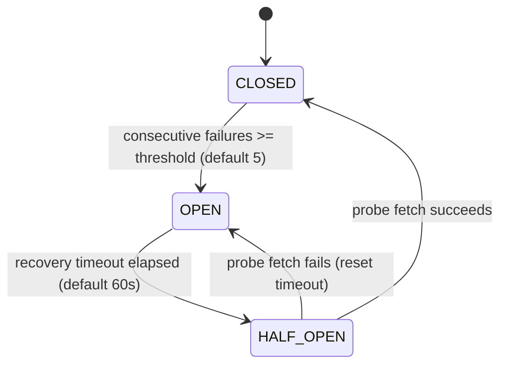

# SentinelPulse Architecture

## Transformation Pipeline

SentinelPulse sits between raw financial news feeds and the AlphaForge signal engine. Its role is strictly transformation — it does not generate trading signals.

The pipeline is a linear sequence of enrichment stages, each publishing to the next via BullMQ:

```
Raw News
  │
  ▼  news.raw
[NormalizationEngine]     — strip HTML, detect language, compute hashes, assign taxonomy
  │
  ▼  news.normalized
[DeduplicationEngine]     — exact-match (URL/hash) + near-duplicate (Jaro-Winkler / cosine)
  │                         collapse into NewsCluster records
  ▼  news.deduplicated
[EntityResolutionEngine]  — extract Company/Instrument/Index/Commodity/Currency/Country/Institution
  │                         resolve to AlphaForge InstrumentMaster IDs
  ▼  news.entities
[EventDetectionEngine]    — extract structured NewsEvents with type, actor, surprise score
  │
  ▼  news.events
[SentimentEngine]         — 5-dimensional sentiment (overall, market, company, macro, risk)
  │
  ▼  news.sentiment
[ImportanceEngine]        — 9-sub-score weighted importance_score (0–1)
  │
  ▼ (inline)
[MarketImpactEngine]      — directional impact per (event, asset), NewsImpactScore –100…+100
  │
  ▼  news.impact
[HistoricalReactionEngine]— actual price/volume responses at –15m…+1d offsets via data-service
  │
  ▼ (inline)
[FeatureEngineeringEngine]— point-in-time correct FeatureVector (importance > 0.3 events only)
  │
  ▼  news.features
[MLDatasetGenerator]      — join FeatureVectors with forward returns → TrainingSample records
```

Simultaneously, the `EmbeddingEngine` generates `vector(1536)` embeddings for articles, events, and entities, stored in `news_embeddings` via pgvector.

---

## Component Diagram

```mermaid
graph TB
    subgraph External["External Sources"]
        RSS1[Reuters RSS]
        RSS2[Moneycontrol RSS]
        RSS3[EconomicTimes RSS]
        API1[Bloomberg API]
        API2[FT CAPI]
        RSS4[CoinDesk RSS]
    end

    subgraph Adapters["Source Adapters"]
        RA[ReutersAdapter Tier-1]
        MA[MoneycontrolAdapter Tier-1]
        ETA[EconomicTimesAdapter Tier-1]
        BA[BloombergAdapter Tier-2]
        FTA[FinancialTimesAdapter Tier-2]
        CA[CoinDeskAdapter Tier-2]
    end

    subgraph Ingestion["Ingestion Engine"]
        SCHED[Scheduler]
        CB[CircuitBreaker Registry]
        RL[RateLimiter Registry]
    end

    subgraph Pipeline["Processing Pipeline"]
        W_NORM[normalize-worker]
        W_DEDUP[dedup-worker]
        W_ENT[entity-worker]
        W_EVT[event-worker]
        W_SENT[sentiment-worker]
        W_IMP[impact-worker]
        W_FEAT[feature-worker]
        W_EMB[embed-worker]
    end

    subgraph Storage["Persistence"]
        PG[(PostgreSQL 16\n+ pgvector)]
        RD[(Redis 7)]
    end

    subgraph API["REST API Fastify"]
        N[/api/v1/news]
        AF[/api/v1/alphaforge]
        ML[/api/v1/ml]
        ADM[/api/v1/admin]
    end

    subgraph Upstream["Upstream Services"]
        DS[data-service\nOHLCV + InstrumentMaster]
        AlphaForge[AlphaForge Signal Engine]
        MLS[ml-service]
    end

    External --> Adapters --> Ingestion
    Ingestion --> W_NORM --> W_DEDUP --> W_ENT --> W_EVT
    W_EVT --> W_SENT --> W_IMP --> W_FEAT
    W_FEAT --> PG
    W_EMB --> PG
    Pipeline --> PG
    Pipeline --> DS
    PG --> API
    RD --> API
    API --> AlphaForge
    API --> MLS
```

---

## Worker / Queue Topology

Every pipeline stage is an independently scalable BullMQ worker. Concurrency is tuned via `WORKER_{NAME}_CONCURRENCY` env vars.

```
Tier-1 sources (Reuters, Moneycontrol, EconomicTimes)  ─┐
Tier-2 sources (Bloomberg, FT, CoinDesk)               ─┤──► news.raw
                                                          │
                                              news-normalize-worker (WORKER_NORMALIZE_CONCURRENCY)
                                                          │
                                                    news.normalized
                                                          │
                                              news-dedup-worker (WORKER_DEDUP_CONCURRENCY)
                                                          │
                                                  news.deduplicated
                                                          │
                                              news-entity-worker (WORKER_ENTITY_CONCURRENCY)
                                                          │
                                                    news.entities
                                                          │
                                              news-event-worker (WORKER_EVENT_CONCURRENCY)
                                                          │
                                                    news.events
                                                          │
                                             news-sentiment-worker (WORKER_SENTIMENT_CONCURRENCY)
                                                          │
                                                   news.sentiment
                                                          │
                                              news-impact-worker (WORKER_IMPACT_CONCURRENCY)
                                                          │
                                                    news.impact
                                                          │
                                             news-feature-worker (WORKER_FEATURE_CONCURRENCY)
                                                          │
                                                   news.features
```

**Dead-letter queues**: Each stage has a `news.{stage}.deadletter` queue. Jobs move there after exhausting 3 retry attempts (exponential backoff starting at 1 s).

**Special queues**:
- `news.embeddings` — fed by EmbeddingEngine; consumed by `news-embed-worker` (WORKER_EMBED_CONCURRENCY)
- `news.backfill` — fed by BackfillEngine; max 20% of total live-pipeline worker concurrency

---

## Service Dependencies

| Dependency | Protocol | Purpose | Fallback |
|-----------|----------|---------|---------|
| PostgreSQL 16 + pgvector | Prisma ORM | Primary state store for all pipeline outputs | None — service marks not-ready |
| Redis 7 | ioredis | BullMQ queues + response cache | Direct PG queries; log WARN |
| data-service | HTTP REST | OHLCV, InstrumentMaster, RegimeSignals | Nulls in reaction/feature records; log WARN |
| Scrapling sidecar | HTTP REST (POST /scrape) | HTML extraction for sources without official feeds | Fetch treated as failed; CircuitBreaker tracks |
| Embedding model API | HTTP REST | Vector generation for articles/events/entities | Enqueue retry in news.embeddings with exponential backoff |

SentinelPulse is a **read-only consumer** of `data-service`. It never writes to data-service databases.

---

## Deployment Topology

```
┌─────────────────────────────────────────────────────────┐
│  Docker Host / Kubernetes Namespace                      │
│                                                           │
│  ┌──────────────┐   ┌──────────────┐   ┌─────────────┐  │
│  │  API Server   │   │  Workers (N)  │   │  Scrapling  │  │
│  │  (Fastify)    │   │  (BullMQ)     │   │  Sidecar    │  │
│  │  Port 3000    │   │               │   │  Port 8001  │  │
│  └──────┬───────┘   └──────┬────────┘   └─────────────┘  │
│         │                   │                              │
│  ┌──────▼───────────────────▼──────┐                      │
│  │        Redis 7 (Port 6379)       │                      │
│  │  Queues + Cache                  │                      │
│  └──────────────────────────────────┘                      │
│                                                           │
│  ┌─────────────────────────────────┐                      │
│  │   PostgreSQL 16 + pgvector       │                      │
│  │   Port 5432                       │                      │
│  └─────────────────────────────────┘                      │
└─────────────────────────────────────────────────────────┘
         │                        │
         ▼                        ▼
   data-service             AlphaForge / ml-service
   (external)               (external)
```

The API server and workers are stateless — they hold no in-process state beyond per-request lifecycle. All job state is stored in Redis (BullMQ) and all persistent state is stored in PostgreSQL. This enables horizontal scaling of both the API tier and individual workers independently.

---

## Ingestion Scheduling

The Scheduler runs an independent `setInterval` loop per source. Within each cycle:

1. All enabled **Tier-1** sources are polled sequentially (Reuters → Moneycontrol → EconomicTimes). Tier-2 sources do not start until all Tier-1 polling is complete or has returned non-healthy.
2. Before each fetch: check CircuitBreaker state (skip if OPEN), run `healthCheck()` (skip + increment failure counter on non-healthy).
3. Successful articles are published to `news.raw`.

Each source's poll interval is configurable via `NEWS_SOURCE_{NAME}_POLL_INTERVAL_MS`.

---

## CircuitBreaker State Machine



Each source has its own isolated CircuitBreaker instance. Configuration is set via `CB_FAILURE_THRESHOLD` and `CB_RECOVERY_TIMEOUT_MS`.

---

## Phase 3A Architecture Changes

### New Components

| Component | File | Purpose |
|---|---|---|
| `InstrumentIndex` | `src/engines/entity/InstrumentIndex.ts` | Singleton O(1) lookup index over 34K data-service instruments. Built-in alias map (~120 entries) + periodic sync from `GET /v1/instruments`. Used by EntityResolutionEngine before falling back to DataServiceClient HTTP calls. |
| `MlServiceClient` | `src/integrations/ml-service/MlServiceClient.ts` | Typed HTTP client for `ml-service POST /predict/regime`. Replaces the broken `DataServiceClient.getRegimeSignals()` (which always returned `[]`). |
| `DataFreshness` | `src/engines/feature-engineering/DataFreshness.ts` | Stateless utility for computing FRESH/STALE/EXPIRED/UNAVAILABLE freshness states. Attached to every feature vector via `FreshnessMetadata`. |
| `src/server.ts` | `src/server.ts` | Entry point that calls `buildApp()` and starts the Fastify server. Handles graceful shutdown on SIGTERM/SIGINT. |
| `src/scripts/run-scheduler.ts` | `src/scripts/run-scheduler.ts` | Standalone scheduler process. Instantiates adapters + Scheduler + rawQueue and starts ingestion. |
| `src/scripts/seed-sources.ts` | `src/scripts/seed-sources.ts` | Idempotent seeder for `news_sources` table. |

### Modified Components

| Component | Change |
|---|---|
| `SsrfGuard` | Added subdomain matching — `www.X.com` now matches parent domain `X.com` in the allowlist. |
| `EmbeddingEngine` | Returns `EmbeddingOutcome` with `embedding_available` and `embedding_status` (COMPLETED/PENDING/SKIPPED/FAILED). Non-blocking — short-circuits immediately when `EMBEDDING_API_KEY` is absent. |
| `NormalizationEngine` | Added `content_depth` (FULL_ARTICLE/SUMMARY/HEADLINE_ONLY) and `content_quality_score` classification. Per-source overrides: Reuters always → HEADLINE_ONLY. |
| `ImportanceEngine` | `fetchSourceReliability()` upgraded to `computeSourceConfidence()` — multi-factor formula: `source_reliability × 0.6 + content_quality_score × 0.4`. |
| `MarketRegimeEngine` | `updateMarket()` now calls `MlServiceClient.predictRegime()` instead of the broken `getRegimeSignals()`. Falls back gracefully when ml-service is unavailable. |
| `EntityResolutionEngine` | 2-layer resolution: InstrumentIndex (O(1), no network) first, then DataServiceClient HTTP lookup for misses. |
| All BullMQ workers | Added explicit Date coercion for `publishedAt` fields (BullMQ JSON-serializes Date→string). Entity/event/sentiment workers now fetch full article from DB using `articleId` (upstream queues publish only `articleId`, not the full article). |
| Admin API | Added `POST /admin/test/pipeline` (inline smoke test) and `GET /admin/lineage/:articleId` (full lineage trace). |

### Content Depth Classification

```
Source                      Content Depth     Quality Score   Source Confidence (example)
Reuters (Google News RSS)   HEADLINE_ONLY     0.25            0.9 × 0.6 + 0.25 × 0.4 = 0.64
Moneycontrol RSS            SUMMARY           0.50            0.85 × 0.6 + 0.5 × 0.4 = 0.71
Economic Times RSS          SUMMARY           0.50            0.85 × 0.6 + 0.5 × 0.4 = 0.71
CoinDesk RSS                SUMMARY           0.50            0.80 × 0.6 + 0.5 × 0.4 = 0.68
Bloomberg API               FULL_ARTICLE      0.90            0.95 × 0.6 + 0.9 × 0.4 = 0.93
Financial Times API         FULL_ARTICLE      0.90            0.95 × 0.6 + 0.9 × 0.4 = 0.93
```

### Regime Integration Architecture

```
BEFORE (broken):
MarketRegimeEngine.updateMarket()
  → DataServiceClient.getRegimeSignals()  [always returned []]
  → classifyRegime([])                     [always returned SIDEWAYS/0.5]

AFTER (Phase 3A):
MarketRegimeEngine.updateMarket()
  → DataServiceClient.getMarketContextSnapshot("NIFTY")   [live quote]
  → DataServiceClient.getMarketContextSnapshot("BANKNIFTY")
  → MlServiceClient.predictRegime(request)                [real ML model]
  → normaliseRegime(prediction.regime)
  → persist + cache
  OR (if unavailable)
  → log WARN, retain cached regime, set regime_data_available=false
```

*Updated: Phase 3A Runtime Certification — 2026-09-15*
